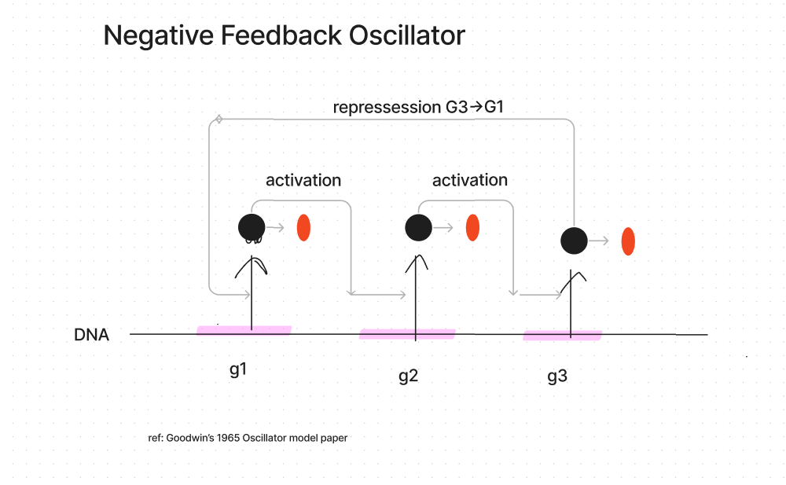

# Computational Biology with Python
A centralized markdown for collecting notes as i follow Mike Saint-Antoine's youtube series, found at [https://www.youtube.com/playlist?list=PLWVKUEZ25V94kdT2Lh97KqB9MoLV9ZzmU].

## Lesson 1
### Central Dogma of Biology
- DNA has sections of instrutions for the building of messenger RNA (Transcription);
- Messenger RNA is used for making proteins (Translation);
- DNA -> transcription -> mRNA -> translation -> Protein
### Modelling the Central Dogma as Ordinary Differential Equations
- rate of transcription is:
  - dm/dt = production of mrna - rate of degradation * abundance of mrna
- rate of translation is:
  - dp/dt = (protein production * abundance of mrna) - (rate of degradation * protein abundance)

### 2 gene interaction model
Given two genes, where gene 1 G1 activates gene 2 G2, the rate of expression of both genes are such as follows:
- for G1:
  - dg1/dt = production of g1 - rate of degradation * quantity
- for G2:
  - dg2/dt = (hill function * max possible production of G2) - rate of degradation * quantity
  - hill function = g1^n / c^n + g1^n (goes from 0 to 1)

When a gene represses another gene, the hill function is:
  - hill = c^n / c^n + g1^n

## 3 Gene Model: negative feedback oscillator

G1 activates G2, G2 activates G3, G3 represses G1

## Deterministic vs Stochastic models
- Deterministic (all inputs are known, output is always the same)
- Stochastic: probability based, output may differ

## Gillespie Algorithm
- also called SSA Method (Sthocastic Simulation Algorithm)
for DNA transcription into mRNA:
- two events:
  - production of mRNA
  - degradation of mRNA strands
- naive calculation:
  - divide in intervals, check for event given probability in every dt